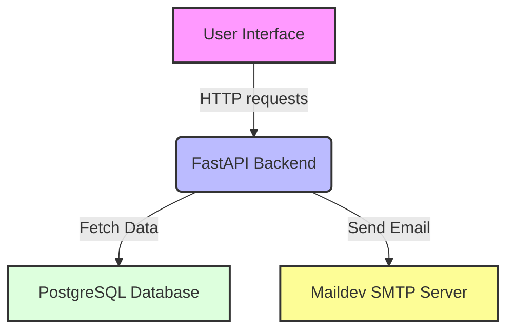

# dailymotion-user-auth

This project demonstrates a FastAPI backend service with PostgreSQL for the database and Maildev for email testing.

## Features

- User registration, login, and account activation via email code.
- Email testing with Maildev.
- Containerized application setup with Docker.

## Architecture



## Prerequisites

- Docker and Docker Compose
- uv

## Getting Started

### 1. Clone the Repository

Start by cloning the repository to your local machine:

```bash
git clone github.com/zbgn/dailymotion-user-auth.git
cd dailymotion-user-auth
```

### 2. Build and Run the Docker Containers
From the root of the project directory, run:

```bash
docker-compose up -d
```

This command will build the Docker images and start the containers.

### 3. Accessing the Application
The FastAPI backend is accessible at http://localhost:8000

Maildev is accessible at http://localhost:1080

### 4. API Documentation
FastAPI generates interactive API documentation using Swagger UI. Once the backend service is running, you can access the documentation at http://localhost:8000/docs.

## Development
Install dependencies:

```bash
uv sync --group dev --group test
```

Run the API locally:

```bash
uv run fastapi dev app/main.py --host 0.0.0.0 --port 8000
```

Run lint checks:

```bash
uv run ruff check .
uv run ruff format --check .
```

### Database Migrations
To update the database schema, modify the initialization scripts and rebuild the Docker containers.

### Sending Emails
Emails for account activation are mocked using Maildev during development. In a production environment, configure the application to use a real email service provider.

## Testing
Run the following command:

```bash
uv run pytest
```

## Deployment
Instructions for deploying the application to a production environment should include details on setting up a secure database, configuring a real email service, and deploying the Docker containers to a cloud service.