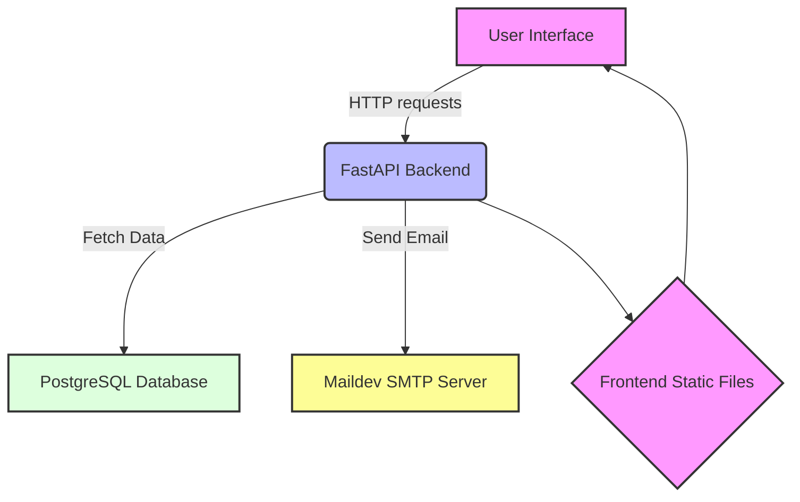

# dailymotion-user-auth

This project demonstrates a full-stack application with a FastAPI backend, Vue.js frontend, PostgreSQL for the database, and Maildev for email testing.

## Features

- User registration, login, and account activation via email code.
- Frontend built with Vue.js for interacting with the API.
- Email testing with Maildev.
- Containerized application setup with Docker.

## Architecture



## Prerequisites

- Docker and Docker Compose
- Node.js and npm (for local frontend development)

## Getting Started

### 1. Clone the Repository

Start by cloning the repository to your local machine:

```bash
git clone github.com/zbgn/dailymotion-user-auth.git
cd dailymotion-user-auth
```

### 2. Build and Run the Docker Containers
From the root of the project directory, run:

```bash
docker-compose up -d
```

This command will build the Docker images and start the containers.

### 3. Accessing the Application
The FastAPI backend is accessible at http://localhost:8000

The Vue.js frontend is accessible at http://localhost:8080

Maildev is accessible at http://localhost:1080

### 4. API Documentation
FastAPI generates interactive API documentation using Swagger UI. Once the backend service is running, you can access the documentation at http://localhost:8000/docs.

## Development
### Backend Development
The backend code is located in the backend directory. To add new endpoints or modify the existing ones, edit the files within this directory.

### Frontend Development
The frontend code is located in the frontend directory. Use npm to install any additional packages:

```bash
cd frontend
npm install
```
To run the frontend locally (outside Docker) for development purposes:
```bash
npm run dev
```

### Database Migrations
To update the database schema, modify the initialization scripts and rebuild the Docker containers.

### Sending Emails
Emails for account activation are mocked using Maildev during development. In a production environment, configure the application to use a real email service provider.

## Testing
### Backend Testing
Run the following command in the backend service container:

```bash
docker-compose exec backend pytest
```
### Frontend Testing
To execute frontend tests, run:

```bash
cd frontend
npm run test:unit
```

## Deployment
Instructions for deploying the application to a production environment should include details on setting up a secure database, configuring a real email service, and deploying the Docker containers to a cloud service.