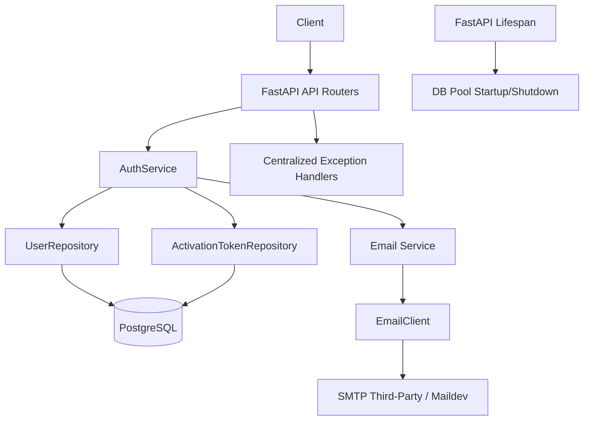

# Dailymotion User Auth Service

## Purpose

This repository implements a focused backend service for the assignment use case:

- create a user account with email and password
- generate and send a 4-digit activation code
- activate the account using Basic Auth and the activation code
- enforce a 1-minute validity window for activation codes

The service is intentionally narrow in scope and does not implement broader authentication features (no login session, JWT, refresh token, or RBAC).

## Tech Stack

- Python 3.12
- FastAPI
- PostgreSQL (explicit SQL with asyncpg, no ORM)
- Maildev (SMTP test service)
- uv (dependency/runtime management)
- Docker + Docker Compose (reproducible run and test workflow)

## Architecture

The codebase uses a pragmatic layered structure:

- API layer: request parsing, response models, endpoint wiring, HTTP semantics
- Service layer: use-case orchestration for register/activate
- Repository layer: explicit SQL and persistence concerns
- Infrastructure layer: settings, DB pool/connection lifecycle, SMTP client
- Domain layer: business exceptions and core models

### Architecture Schema



## Runtime Configuration

The backend reads configuration from environment variables:

- `DATABASE_URL`
- `SMTP_SERVER`
- `SMTP_PORT`
- `TZ`

In Docker Compose, these are preconfigured for local evaluation.

## Run Instructions (Docker-only)

### 1. Build and start services

```bash
docker compose up --build -d
```

This starts:

- `backend` on `http://localhost:8000`
- `db` (PostgreSQL)
- `maildev` on `http://localhost:1080`

### 2. Verify service health

```bash
curl http://localhost:8000/api/v1/health
```

Expected response:

```json
{"status":"ok"}
```

### 3. Stop services

```bash
docker compose down -v
```

## Test Instructions

### Reproducible tests in Docker (recommended)

```bash
docker compose run --rm backend uv run pytest
```

### Local tests (optional)

```bash
uv sync --group dev --group test
uv run pytest
```

## API Endpoints

The versioned API is the recommended interface.

### Health

- `GET /api/v1/health`

Response:

```json
{"status":"ok"}
```

### Register User

- `POST /api/v1/register/`
- Body:

```json
{
    "email": "user@example.com",
    "password": "your-password"
}
```

Success response (`200`):

```json
{
    "id": 1,
    "email": "user@example.com",
    "is_active": false
}
```

Business error response (`400`):

```json
{"detail":"Email already registered"}
```

Third-party delivery error (`503`):

```json
{"detail":"Email delivery failed"}
```

### Activate User

- `POST /api/v1/activate/`
- Auth: HTTP Basic (`email` + `password`)
- Body:

```json
{
    "token": "1234"
}
```

Success response (`200`):

```json
{
    "id": 1,
    "email": "user@example.com",
    "is_active": true
}
```

Business error responses (`400`):

- `{"detail":"Invalid credentials"}`
- `{"detail":"User already active"}`
- `{"detail":"Invalid token"}`
- `{"detail":"Expired token"}`

### OpenAPI Documentation

- `GET /docs` (Swagger UI)

## Key Design Decisions

### 1. Explicit SQL, no ORM

Repositories use `asyncpg` with explicit SQL statements to satisfy assignment constraints and keep persistence logic transparent.

### 2. Transaction boundaries at service layer

`AuthService` owns transaction boundaries for each use case so all related repository operations share one connection/transaction scope.

### 3. Deterministic token validity checks

Token expiration is enforced in SQL using database UTC time, reducing wall-clock drift issues and making behavior more deterministic.

### 4. Centralized business error mapping

Business exceptions are mapped once in FastAPI exception handlers to provide stable API error semantics and avoid duplicating `HTTPException` logic in routes.

### 5. FastAPI DI and lifespan

- Dependency providers wire settings, repositories, and services.
- Lifespan startup/shutdown manages infrastructure resources, especially DB pool lifecycle.

## Email Third-Party Handling

Email sending is treated as an external integration:

- service layer calls `send_email`
- infrastructure `EmailClient` handles SMTP transport
- local evaluation uses Maildev as the SMTP server

Registration email failure policy is explicit and fail-closed:

- if activation email delivery fails after user/token creation, the service performs a compensating cleanup (delete token and user)
- the API returns `503 Service Unavailable` with `{"detail":"Email delivery failed"}`
- this avoids reporting a successful registration when no activation notification was delivered

Activation confirmation email failure policy is explicit and best-effort:

- user activation is already committed in database transaction scope
- if confirmation email delivery fails, the service logs the failure and does not propagate it as an API error
- the activation endpoint still returns success for the committed state change, keeping response contract consistent with persisted state

This keeps transport-specific concerns outside business orchestration.

## Why Basic Auth for Activation

Basic Auth is used on activation endpoint because it is an explicit assignment requirement. The service intentionally keeps this mechanism for evaluation scope correctness and does not extend into broader auth flows.